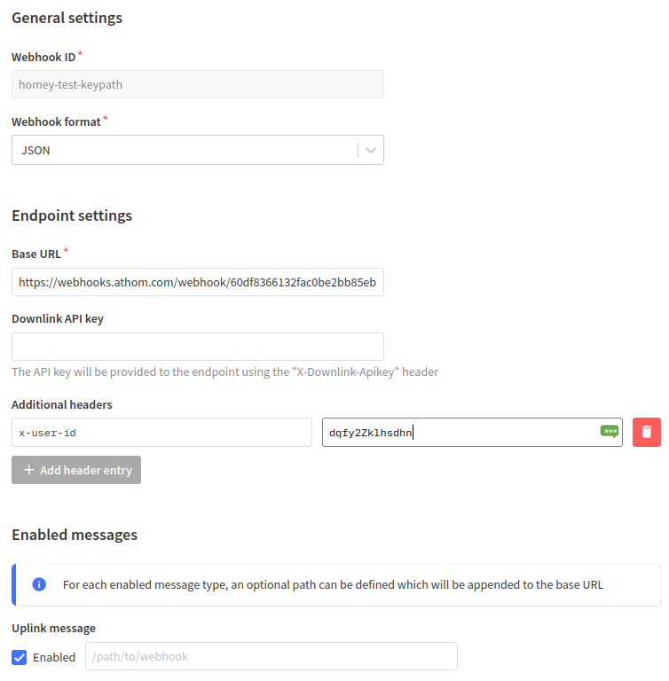

# Development version - only for testing!
Changes:  
Many of the flowcards are broken  
Implements end devices as individual devices on app  
Implements Gateway as device in Homey for TX/RX statistics and offline alarms
Only simple on/ off supported at the moment  
When a webhook is received the app records the downlinkApi Key for later use  
  
To add a device go into the pairing mode on the Homey app & trigger an uplink from the TTN console. If the end device hasn't been seen before it will be added as a new end device  

# The Things Network

Make Homey part of a global loRaWAN network using The Things Network (TTN) & webhooks.

### Support
If you like this app & want to support further development please consider buying me a [coffee](https://www.buymeacoffee.com/oohehir).  

Forum discussion on this [app](https://community.athom.com/t/48869).  

### Note
I am not affiliated to 'The Things Network', this is my own work to hopefully help others integrate Homey & TTN.  
This app does NOT implement loRa on Homey, rather it uses the internet to connect to TTN servers & pass data back & forth. From the TTN servers the data is relayed via LoRaWAN gateways to end devices. For more info start [here](https://www.thethingsindustries.com/docs/getting-started/quick-start/)   

The app assumes that your end device is connected correctly to the TTN stack v3.

### Setup a gateway (no webhook required) 
All public gateways can be added as a Homey device. If your own gateway doesn't show up, make sure that it is set as public in the Things console.
When adding a gateway to Homey the closest gateways can be automatically selected. You can also choose to do a manual setup. In that case you need to go into the device advanced settings afterwards, and manually change the ID, netID and tenantID to match the gateway you want to have.

### Setup end device (using webhook template) - preferred method
1. After installing the app on Homey, go to the app 'Configure App' page. It shows the 'Webhook ID' & 'Keypath Value'.
2. On your TTN console (for [Europe](https://eu1.cloud.thethings.network/console/applications/)) select: 'Relevant Application> Integrations > Webhooks > '+ Add Webhook'> Homey Template. Fill in the details from step 1.
3. Save!

### Setup end device (using custom webhook) 
1. After installing the app on Homey, go to the app 'Settings' page. It shows the 'Webhook ID' & 'Keypath Value'.
2. On your TTN console (for [Europe](https://eu1.cloud.thethings.network/console/applications/)) select: 'Relevant Application> Integrations > Webhooks > '+ Add Webhook'> Custom Template. Fill in the details as follows:  
    webhook ID - a meaningful name for your own use  
    webhook format - JSON   
    BaseURL: https://webhooks.athom.com/webhook/Webhook_ID_from_settings   
3. Add an additional header using authorization:  
    x-user-id      Keypath_Value_from_settings  
4. Tick 'Uplink message' enabled box 
5. Save!



### Flowcards
Flows can be triggered by  
1. Uplink message
2. Uplink message from specific device
3. Uplink message from specific application 
4. Gateway going offline and TX/RX statistics (no webhook required)

### Payload Formatters
Due to the low data rate of loRa data is made as compact as possible when transmitted 'over the air'. Examples of encoding schemes to compact data are shown [here](https://www.thethingsnetwork.org/docs/devices/bytes/). Using TTN payload [formatters](https://www.thethingsindustries.com/docs/integrations/payload-formatters/) it is possible to convert this 'packed data' into more meaningful states & values before they are sent by webhook to Homey. 

Two strings (state1 & state2) & two values (value1 & value2) are extracted by this app & events can then be triggered, using appropriate logic cards, depending on their contents. An example is shown below.

```javascript
function decodeUplink(input) {
  
  // Assume 4 bytes received, e.g. 0x01, 0x9F
  // state1 & state2 must be strings/ word
  // value1 & value2 must be numbers
  
  // More examples here:
  // https://www.thethingsnetwork.org/docs/devices/bytes/
  
  var data = {};
  
    if (input.bytes[0] == 1){
      data.state1 = "On";
    } else{
      data.state1 = "Off";
    }
    
    if (input.bytes[1] == 1){
      data.state2 = "Open";
    } else{
      data.state2 = "Closed";
    }
    
    data.value1 = 5.2 * input.bytes[2];
    data.value2 = 25 + input.bytes[3];
    
  return {
    data: data,
    warnings: [],
    errors: []
  };
}
```

Below is a simple downlink formatter that works with a simple payload


```javascript
function encodeDownlink(input) {
  // Input is a string true or false
  var bytes = [];
  
  if (input.data.data.state1 == "false"){
      bytes[0] = 0;
    }
    else if (input.data.data.state1 == "true"){
      bytes[0] = 1;
    }
    else{
      bytes[0] = 2;
    }
  
  if (input.data.data.state2 && input.data.data.state2 === "false"){
      bytes[1] = 0;
    }
    else if (input.data.data.state2 &&  input.data.data.state2 === "true"){
      bytes[1] = 1;
    }
    else{
      bytes[1] = 2;
    }
  
  return {
    bytes: bytes,
    fPort: input.fPort,
  };
}

function decodeDownlink(input) {
  return {
    data: {
      state1: ["false", "true", "other"][input.bytes[0]],
      state2: ["false", "true", "other"][input.bytes[1]]
    }
  };
}
```


**Version 0.0.1**
- Initial release

